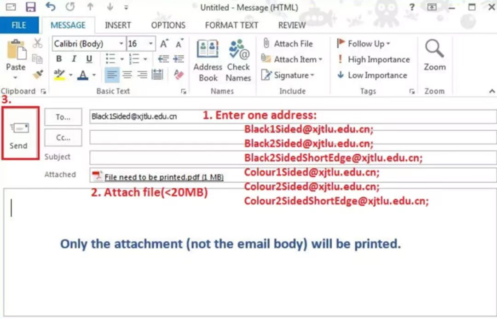

# 打印机

## 打印机位置

打印机是我们在校园里常用的工具，其位置是：

FB323
SC321
SD323
EB367
LIB 1、3、4、5F
CB 9F
CB1112
HS127
DB106A
ES103
DBG06
DB106A
DB2F
DB3F
BS3F
GYM1F
GYM2F

## 打印机价格

A4 黑白单面 0.2RMB/页

A4 黑白双面 0.36RMB/页

A4 彩色单面 1.0RMB/页

A3 黑白单面 0.4RMB/页

A3 黑白双面 0.72RMB/页

A3 彩色单面 2.0RMB/

## 用自己的电脑连接打印机（Windows）

首先需要连接好学校的WIFi，用户名和密码就是同学们登录eb的账户和密码，然后同时按住win+R两个键，会出现运行窗口，然后输入一行代码：
代码有下面几种，它们的开头都是

\\ss-print.xjtlu.edu.cn

并加上后缀：

\Black2Sided 是黑白双面打印

\Black2SidedShortEdge 是黑白双面 沿短边反转打印

\Colour1Sided 是彩色单面打印

\Colour2Sided 是彩色双面打印

\Colour2SidedShortEdge 是彩色双面 沿短边反转打印

输入成功后会弹出一个窗口，将所需打印的文件拖入该窗口即可。

## 用邮箱进行打印申请

请发邮件到上述邮箱，将要打印的文件放在附件里即可安排打印任务。
接下来只需要带着学生卡去任意打印机打印机就可以啦！
